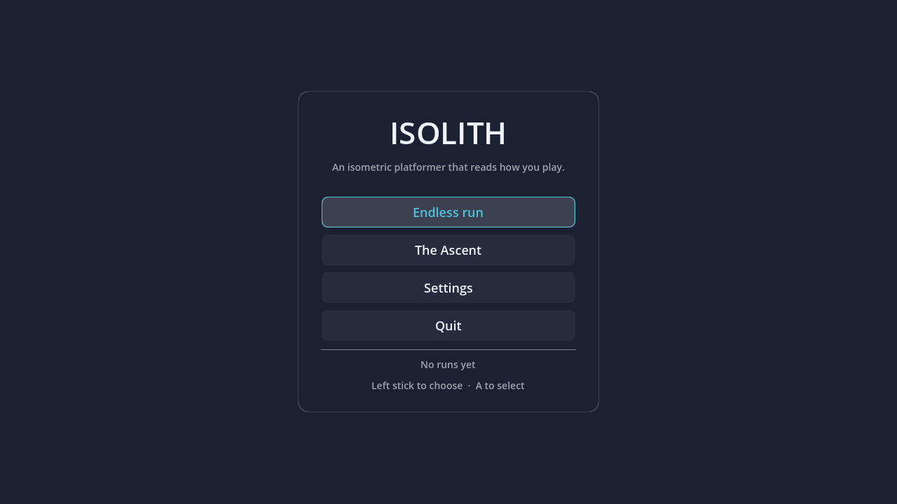
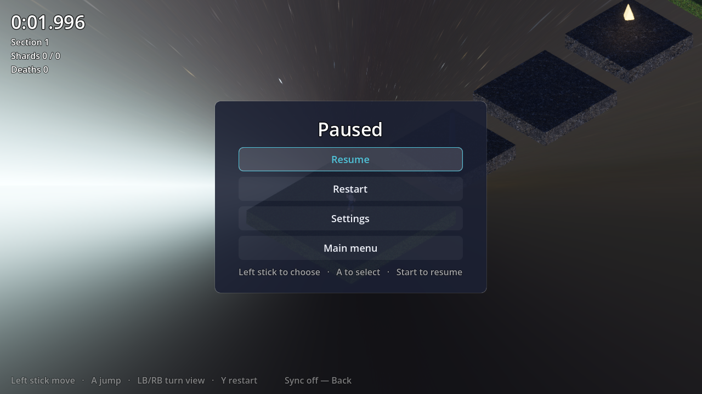

# Isolith

An isometric 3D platformer, built with Godot 4.7 and C#.

Jump between floating stone platforms, collect shards, don't fall in the spikes.
It's a game first: it plays offline, keeps its own local history, and needs no
account. Optionally, it can also copy your run stats into your own AT Protocol
repo — see [Stat sync](#stat-sync-optional), which is genuinely optional.

> Independent project; see the [trademark notice](TRADEMARKS.md).



## Features

- **True isometric camera** — orthographic, pitched to `atan(1/√2)`, rotatable
  in 90° steps so geometry never hides the route.
- **Platformer feel that forgives** — coyote time, jump buffering, variable jump
  height, and separate rise/fall gravity.
- **Gamepad first** — the analog stick drives speed directly; keyboard is the
  fallback, and on-screen hints follow whichever you last touched. Every menu is
  fully navigable with a stick and two buttons, and the smoke test fails if a
  control is left without a focus neighbour.
- **Endless mode that reads you** — sections are generated ahead of you, and
  each one is shaped by how the previous one actually went. Die and it eases;
  cruise and it pushes; keep falling off *moving platforms specifically* and it
  backs off moving platforms while staying hard everywhere else.
- **Levels as data** — authored courses are JSON, built into geometry at load
  time. No binary scene files to merge, and every level is a readable diff.
- **Course hazards** — moving platforms you ride, platforms that crumble under
  you, bounce pads, spike pits, and checkpoints.
- **Honest assets.** Every sound is synthesised by a script in this repository
  and every mesh is built in code; the sky and surface materials are CC0 packs,
  fetched with pinned checksums. Full provenance in [ASSETS.md](ASSETS.md).

## Requirements

| | |
| --- | --- |
| Godot | 4.7 (.NET / Mono build) |
| .NET SDK | 10.0 |
| Python | 3.10+ — only to regenerate audio |

## Getting started

```bash
git clone https://github.com/ewanc26/isolith.git
cd isolith
dotnet build
```

The CC0 sky and material packs are committed, so there is nothing else to fetch.
To re-pull or update them:

```bash
python3 tools/fetch_assets.py
```

Then open `project.godot` in Godot 4.7 (.NET) and press F5, or run it directly:

```bash
godot --path .
```

To regenerate the sound effects (they are committed, so this is only needed if
you change the generator):

```bash
python3 tools/generate_assets.py
```

## Controls

Gamepad is the primary scheme; keyboard mirrors it.

| Action | Gamepad | Keyboard |
| --- | --- | --- |
| Move | Left stick / D-pad | WASD or arrows |
| Jump | A | Space |
| Turn view 90° | LB / RB, or flick right stick | Q / E |
| Zoom | Triggers | `+` / `-`, mouse wheel |
| Restart course | Y | R |
| Pause | Start | Esc |
| Sync panel | Back | F1 |

Hold jump for height and release early to cut it short. You get a moment of
coyote time after leaving a ledge, and a jump pressed just before landing is
remembered.

Bindings live in [`src/Core/GameInput.cs`](src/Core/GameInput.cs) rather than in
`project.godot`, so they stay readable in a diff.

Pausing opens a menu — resume, restart, settings, or back to the title screen.



## Settings

Reachable from the title screen and from the pause menu, and stored as a plain
INI at `user://settings.cfg` that you can open and edit by hand.

| Setting | Notes |
| --- | --- |
| Master volume | Rides on the Master audio bus |
| Effects volume | Relative to master; zero genuinely mutes rather than playing silent voices |
| Fullscreen | |
| Camera zoom | The same value the in-game zoom controls move, so the two never disagree |
| Explain difficulty changes | Whether endless mode narrates what the director just decided |

The sync panel's handle and PDS are remembered here too, once a sign-in has
actually succeeded. App passwords never are.

## Endless mode

The default mode. There is no finish line: sections are generated in front of
you, and the generator reacts to the section you just played.

| What you did last section | What happens next |
| --- | --- |
| Died | Gaps shorten, platforms widen, hazards thin out |
| Died on a moving platform | Moving platforms specifically become rare, then return gradually |
| Ignored the bounce pads | Fewer bounce pads — you haven't taken to them |
| Cleared it cleanly and quickly | Gaps stretch toward the limit of what you can jump |
| Only just made every landing | Difficulty **holds**, even though you didn't die |
| Hesitated before jumps | Gaps become more consistent, so distances are learnable |
| Collected every shard | Shards start appearing over the gaps instead of on the path |

The bottom of the screen tells you what it decided and why ("easing — 2 deaths").

Difficulty falls faster than it rises, on purpose. Relief should arrive
immediately; pressure should be earned.

**Every generated jump is guaranteed to be possible.** Gaps are clamped against
an envelope computed from the character's own tuning constants, so the generator
cannot produce something you physically cannot cross — and the test suite proves
it over thousands of generated jumps at every difficulty.

Set `Seed` on the `Main` node to any non-zero value to replay a run exactly.

To play the hand-authored course instead, set `Mode` to `Authored` on the `Main`
node in the editor.

## Writing a course

Drop a JSON file in `courses/` and point `GameManager.CoursePath` at it.

```json
{
  "id": "example",
  "name": "Example",
  "spawn": [0, 1.5, 0],
  "killPlaneY": -20,
  "blocks": [
    { "pos": [0, -0.5, 0], "size": [8, 1, 8], "kind": "Grass" },
    { "pos": [0, 0.1, -9], "size": [5, 1, 5], "kind": "Solid" }
  ],
  "movers": [
    { "from": [-25, 3.4, -18], "to": [-25, 3.4, -10],
      "size": [3.5, 0.6, 3.5], "period": 6.0, "phase": 0.0 }
  ],
  "shards": [[0, 1.6, -9]],
  "checkpoints": [[0, 1.8, -25]],
  "goal": [-25, 9.65, 11]
}
```

`kind` is one of `Solid`, `Grass`, `Hazard`, `Bounce`, or `Crumble`. Positions
are centres and sizes are full extents, so a block's walkable surface sits at
`pos.y + size.y / 2`.

A fully held jump clears about **2.4 m of height** and **5.9 m of distance**, so
keep gaps inside that envelope. The smoke test will tell you if the spawn,
checkpoints, or goal end up over a void.

## Testing

```bash
godot --headless --path . res://scenes/Smoke.tscn
```

This loads every course, builds it, checks the built scene matches the data, and
verifies the spawn, every checkpoint, and the goal are all standable — a level
whose goal hangs over nothing is valid JSON but not a finishable course.

It also exercises procedural generation: 3200 generated jumps across the full
difficulty range must all be within reach, generation must be reproducible from
its seed, and the director must ease after deaths, hold after near-misses, and
target the specific mechanic that killed you.

For the UI it checks that the title screen builds, that no control is left
without a focus neighbour, and that a stored setting reaches the thing it
configures — a preference that saves perfectly and is read by nobody looks
identical from the outside.

Exits non-zero on failure, and runs in CI.

To eyeball a visual change without playing through to it — this one needs a real
renderer, so it cannot run headless:

```bash
godot --path . res://scenes/Screenshot.tscn
```

Frames land in `docs/shots/`.

## Stat sync (optional)

Isolith can copy completed runs into your own AT Protocol repo as
`uk.ewancroft.isolith.run` records. It uses [wolfram][wolfram], a C11
implementation of the protocol, through a P/Invoke wrapper in `src/Sync/`.

**This is a side feature.** Every run is saved locally first, unconditionally.
Sync is off by default, the game never prompts for it, and every failure is
non-fatal.

To enable it, build `libwolfram` and drop it in `native/` (see
[`native/README.md`](native/README.md)), then press Back / F1 in game and sign in
with your handle and an **app password**. The password is used for a single
`createSession` call and is never written to disk; no session token is persisted
either, so signing in is per-session by design.

The record schema is in [`lexicons/uk/ewancroft/isolith/run.json`](lexicons/uk/ewancroft/isolith/run.json).
Runs carry a SHA-256 of the course JSON, so times stay comparable only within a
single version of a level — edit a course and old times stay attached to the
layout they were set on.

Only your own repo is read and written. There is no cross-user leaderboard;
that would need an AppView aggregating the collection, which is out of scope here.

## Layout

```
courses/        Level data (JSON)
docs/shots/     Screenshots, generated by scenes/Screenshot.tscn
lexicons/       AT Protocol record schemas
native/         Drop libwolfram here (not vendored)
scenes/         Menu.tscn (main scene), Main.tscn, Player.tscn, Smoke.tscn
src/Core/       Input map, settings, run stats, local history, audio, smoke test
src/Gameplay/   Player, camera, course objects, game manager
src/Level/      Course format, builder, palette
src/Level/Generation/  Endless mode: director, generator, jump envelope
src/Sync/       Optional AT Protocol sync (interop + service)
src/UI/         Title screen, settings, HUD and sync panel
tools/          Asset generators and CC0 asset fetcher
```

All runtime code is C#. GDScript is reserved for editor-only tooling, and
Python is repository tooling only — the game builds and runs without it, since
generated assets are committed.

`AGENTS.md` has the full architecture notes, the language policy, the invariants,
and the conventions. [`docs/ecosystem.md`](docs/ecosystem.md) surveys Godot
addons and CC0 asset sources against those constraints.

## Support

If you find this project useful, consider supporting its development:

[](https://ko-fi.com/ewancroft)
[](https://github.com/sponsors/ewanc26)

## Licence

Code is [MIT](LICENSE). Assets are additionally released under
[CC0 1.0](https://creativecommons.org/publicdomain/zero/1.0/); see
[ASSETS.md](ASSETS.md).

[wolfram]: https://github.com/ewanc26/wolfram
